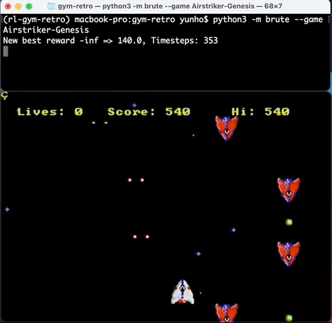
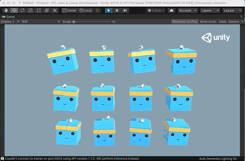
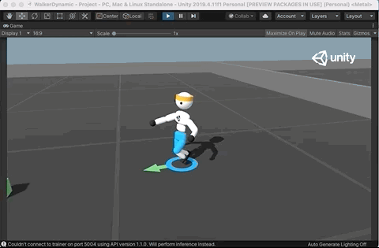
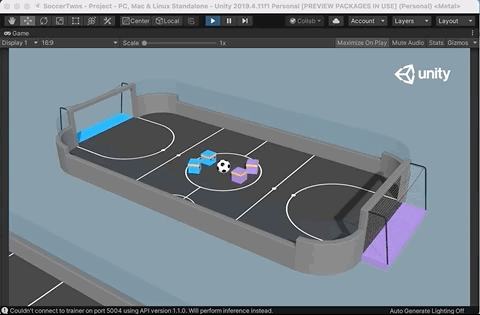
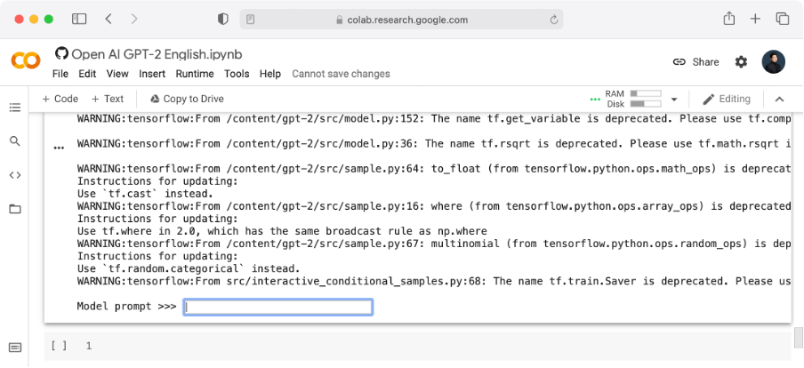
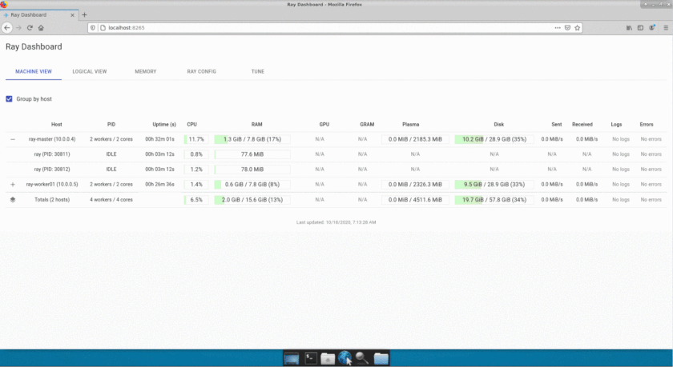
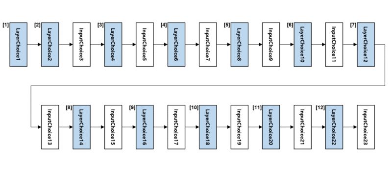

# start-RL
《Do it 강화 학습 입문(Beginning Reinforcement Learning)》 소스 코드 저장소 

<!-- [](https://www.yes24.com/Product/Goods/91879171) -->

- __소스 코드 저장소 다운로드__ [do-it-reinforcement-learning.zip](https://github.com/yunho0130/start-RL/archive/master.zip)

## 실습 소스 코드

### 03장 알파고 도전을 위한 첫 걸음

* __OpenAI Gym Retro 환경에서 강화 학습 모델 훈련시키기__   
    
    - Airstriker-Genesis 게임을 플레이하는 강화 학습 모델  
    

    [OpenAI gym-retro 소스 코드 살펴보기](https://github.com/yunho0130/start-RL/tree/master/gym-retro)  

* __UnityML 환경에서 강화 학습 모델 훈련시키기__   

    - 머리 위에 올려진 공을 떨어뜨리지 않는 3Dball 환경  
      

    - 이족보행을 학습시켜 목적지까지 이동시키는 Walker 환경  
      
 
    - 여러 에이전트간 상호작용이 필요한 Soccer 환경  
      

    [UnityML 소스 코드 살펴보기](https://github.com/yunho0130/start-RL/tree/master/unityML)

### 05장 영화 <아이언맨>의 자비스 만들기
* Google Colab 통한 실습  
아래의 Jupyter Notebook 파일은 Google Colab과 연결되도록 만들어 두었습니다. 이를 통해 05장의 주요 강화 학습 모델 학습 코드를 간편하게 실행해 보세요.

* __OpenAI GPT-2로 알아보는 자연어 처리__  

      

    - 자비스 실습 코드 살펴보기 [Open_AI_GPT_2_English_Jarvis.ipynb](https://colab.research.google.com/github/yunho0130/start-RL/blob/master/gpt2/Open_AI_GPT_2_English_Jarvis.ipynb)  

* __OpenAI GPT-3와 강화 학습의 미래__   

    - Beta 버전 API 신청하러 가기 https://beta.openai.com/ 
    - API Key 권한 획득 후, 실습해 보기 [gpt3_curl_cmd.ipynb](https://colab.research.google.com/github/yunho0130/start-RL/blob/master/gpt3/gpt3_curl_cmd.ipynb)  

### 06장 분산 강화 학습 공부하기
* __MS Azure 무료 체험으로 할 수 있는 분산 강화 학습 실습__
    - 윈도우 원격 데스크톱 접속 환경 구성하기
    - Ray 아키텍쳐 및 RLlib 설치 하기
    - 분산환경에서 카트폴 실행 하기

 

 [분산 강화 학습 실습 명령어 및 예제 코드 살펴보기](https://github.com/yunho0130/start-RL/tree/master/Distributed%20RL)
 
 ### 07장 강화 학습으로 만드는 신경망 구조
* __NNI ENAS를 활용한 NAS 실습 보기__
    - 매크로 탐색 공간을 활용한 ENAS
    - 마이크로 탐색 공간을 활용한 ENAS
    - ENAS에서 생성된 신경망 구조를 활용한 재학습

 

 [NNI ENAS 실습 명령어 및 예제 코드 살펴보기](https://github.com/yunho0130/start-RL/tree/master/NAS)

<!-- ### 자주 묻는 질문 FAQ
- 추후 추가 예정 -->

### 인용 Citation
본 레파지토리나 《Do it! 강화 학습 입문》의 내용을 인용하실 때에는 아래의 인용 정보를 사용하시면 편리합니다.
```
@book{Do-it-Reinforcement-Learning,
  title={Do it! 강화 학습 입문},
  author={조규남, 맹윤호, 임지순},
  isbn={9791163032526},
  url={http://www.yes24.com/Product/Goods/101924618},
  year={2021},
  publisher={이지스퍼블리싱}
}
```
